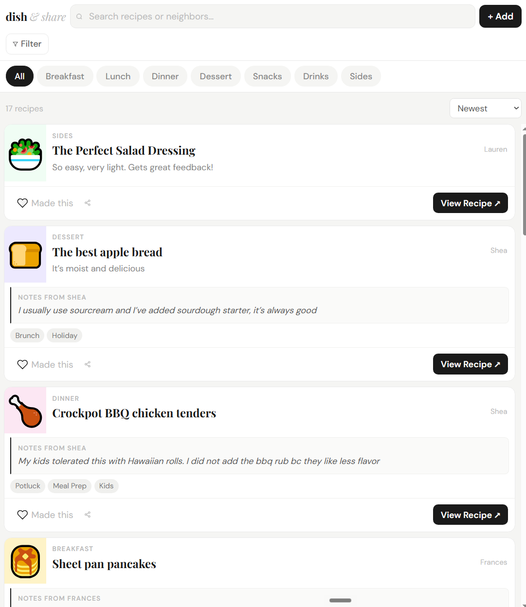

# Dish & Share

A small, mobile-friendly recipe board for a neighborhood, friend group, or family — built entirely on Google Sheets + Google Apps Script, so there's no server, no database, and no hosting bill.

Everyone drops in a link to a recipe they love, adds a note on how they actually make it ("I usually use sour cream and add sourdough starter"), tags it (Potluck, Meal Prep, Kids, Brunch...), and the board turns it into a searchable, filterable feed. Other people react with a heart ("Made this") instead of leaving a comment, and can share a recipe straight from the card.

It runs as a Google Apps Script **web app**, with a Google Sheet as the only "database." No accounts, no signup — anyone with the link can browse and add a recipe.



## What it looks like

A card feed: emoji icon (auto-picked from the recipe name — tacos get 🌮, pancakes get 🥞), category tag, contributor name, description, their notes in an italic callout, dietary/occasion tag chips, and a heart-react + share row at the bottom. Filterable by category, dietary need, and occasion; sortable by newest, most loved, A–Z, or by contributor.

## How it works

- `src/app.html` — the entire front end (HTML/CSS/JS in one file, no build step, no framework). Renders the feed, the filter/search bar, and the "Add a Recipe" form.
- `src/Code.gs` — the Apps Script backend. Three functions: `getRecipes()` reads every row of the Sheet, `addRecipe(data)` appends one, `addReaction(id)` increments the heart count for a row.
- `src/appsscript.json` — the project manifest (timezone, web app access settings).
- The Google Sheet **is** the database. One row per recipe. `setup()` writes the header row for you.

There's no auth layer — the web app runs as whoever deployed it, so it can write to their private Sheet even though visitors never see or touch the Sheet directly.

## Deploy your own copy

You don't need any of my accounts or data — this creates a fresh Sheet and script under your own Google account.

**You'll need:** a Google account, [Node.js](https://nodejs.org) installed, and 10–15 minutes.

1. **Install `clasp`** (Google's official CLI for Apps Script), if you don't have it:
   ```bash
   npm install -g @google/clasp
   ```

2. **Log in and enable the Apps Script API** (one-time, per Google account):
   ```bash
   clasp login
   ```
   Then visit [script.google.com/home/usersettings](https://script.google.com/home/usersettings) and turn ON "Google Apps Script API."

3. **Clone this repo and create your own Sheet + script project:**
   ```bash
   git clone https://github.com/frantang3/dish-and-share.git
   cd dish-and-share/src
   clasp create --type sheet --title "Dish & Share"
   ```
   This creates a brand-new Google Sheet (your database) and links a new Apps Script project to it. It also writes a `.clasp.json` with your new project's ID — that file is yours, don't commit it back here (it's already git-ignored).

4. **Push the code up:**
   ```bash
   clasp push
   ```

5. **Run setup once**, to write the header row the app expects:
   ```bash
   clasp open
   ```
   In the Apps Script editor that opens, pick `setup` from the function dropdown at the top and click **Run**. The first time, Google will ask you to authorize the script — approve it (it's your own script, running under your own account).

6. **Deploy as a web app:**
   ```bash
   clasp deploy
   ```
   Or from the editor: **Deploy → New deployment → Web app**. Set "Execute as" to **Me** and "Who has access" to **Anyone** (or "Anyone with Google account" if you want to keep it off the open internet). Copy the web app URL it gives you — that's your live Dish & Share board.

7. **Share the URL.** Anyone who opens it can browse and add recipes; every submission lands as a new row in your Sheet.

### Making changes later

Edit `src/app.html` or `src/Code.gs`, then:
```bash
clasp push
clasp deploy
```

## Notes

- All data lives in your Google Sheet — export, back up, or edit it there like any spreadsheet.
- There's no per-user accounts or moderation queue. Anyone with the link can post. Fine for a trusted group; not meant for a public, unmoderated audience.
- `image` is a reserved column for a future photo-upload feature; the current UI doesn't use it yet.

## License

MIT — see [LICENSE](LICENSE).
